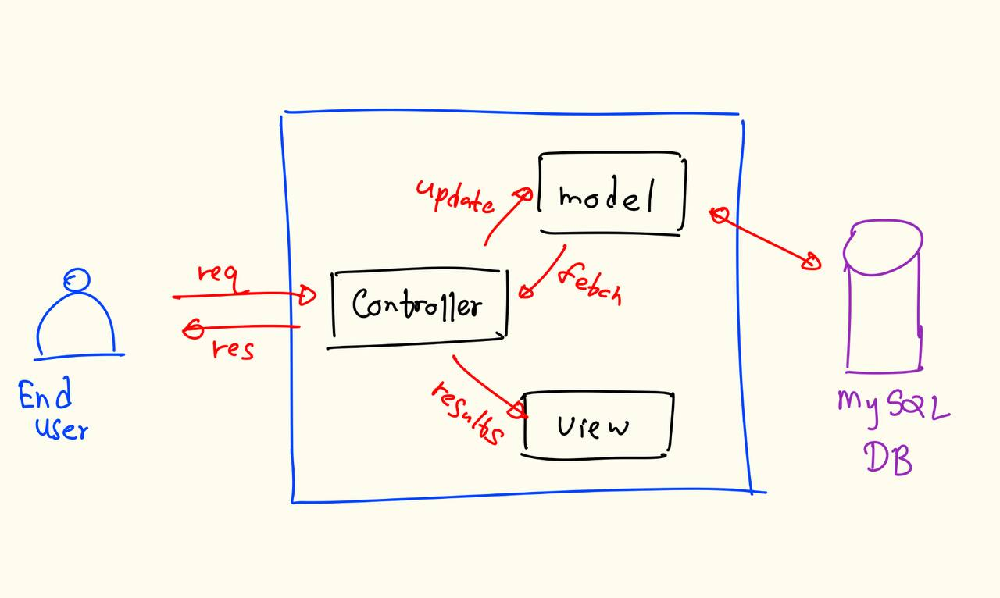

## OOP concepts usage   
I applied core OOP principles like encapsulation and inheritance.

### Encapsulation
 I created classes such as User, SpareParts, Buyer, and Seller, where each class had private fields with public getter and setter methods. This protected the data and ensured that object state could only be modified through controlled access.

 ### Inheritance
 Though the project was relatively simple, I applied inheritance for reusable components, for example, a generic User class, which could be extended by Seller and Buyer classes in more advanced versions.

## Usage of MVC architecture   
### Model  
The Model layer handled all the data-related logic. I created Java classes to represent spare parts and users, and these interacted with the MySQL database through a Singleton-based database connection manager to ensure thread-safe access.
### View  
The View layer was built using JSP (JavaServer Pages), which rendered the data in a user-friendly interface and allowed dynamic content display using Java embedded in HTML. I styled the UI with TailwindCSS for responsiveness.
### Controller  
The Controller layer consisted of Java Servlets that handled incoming HTTP requests. These controllers processed user input, interacted with the model to fetch or update data, and then passed the results to the corresponding JSP pages for rendering.  

## Why Singleton desing pattern for DB connectivity?   
The main goal is to ensure that only one instance of the DB connection manager exists throughout the application's lifecycle.

I used the Singleton design pattern by making the constructor private and providing a static method like getInstance() to return the single shared instance. The class was responsible for initializing the database connection using JDBC, and it exposed methods to retrieve or close connections as needed.

## Usage of exception handling   
Exception handling <b>manages run time errors</b> using try catch block. We can use try, catch, throw, throws, finally keywords.

I have used two exceptions types in the services classes.
<ol>
<li>Class not found exception - If the JDBC driver class is not found in the classpath. Simply it is missing the driver class.</li>
<li>SQL exception - If any issues with database operations. 
<i>eg: connection failure, invalid sql query, database server error </i></li>
 
</ol>
